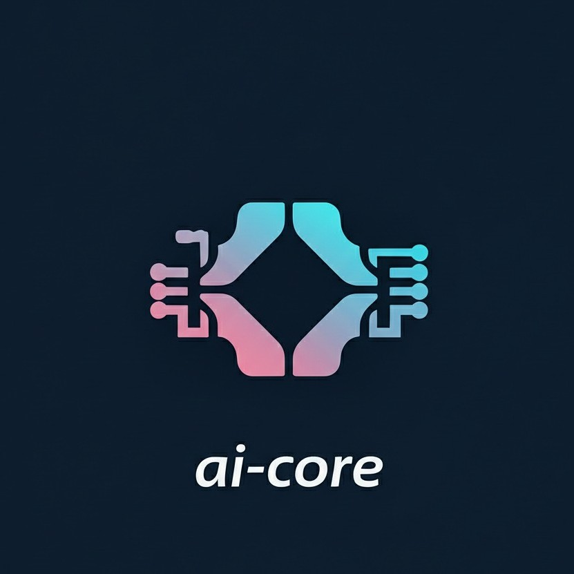
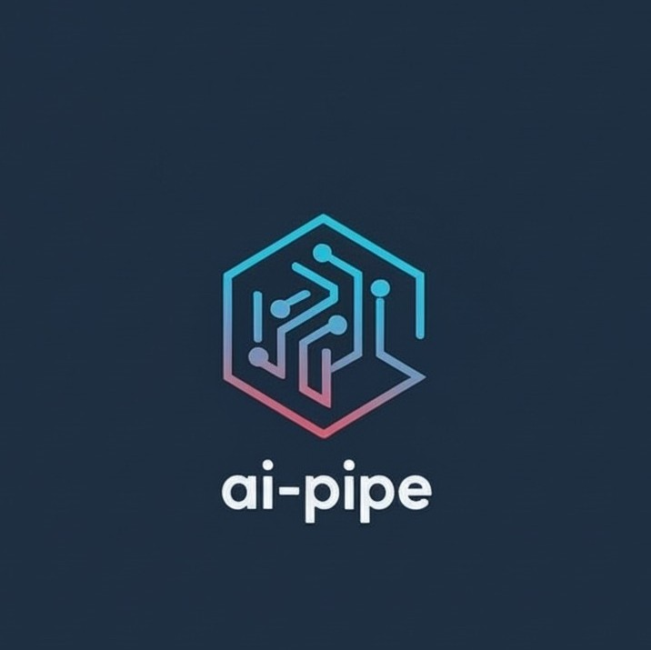

  <!-- Placeholder for a logo or banner image -->
  <!-- Replace the src attribute with the path to your image -->
  

  <h1>Hi there, I'm @sinterwong 👋</h1>

---

## 🚀 About Me

I'm a passionate developer interested in all programmable tasks, with a special focus on back-end development. I'm constantly learning and exploring new technologies to build efficient and scalable solutions.

Currently diving deep into C++, engineering and advanced back-end concepts.

---

## 💻 Tech Stack

Here are a few technologies I've been working with recently:

  
  
  
  
  

---

## ✨ My Projects

Here are some of the projects I'm proud of.

  
ai-core

   
  
  

    <strong>Description:</strong> It encapsulates multiple inference frameworks and provides a unified interface.
     
    <strong>Tech Stack:</strong> c++, ai, opencv etc.
     
    <a href="https://github.com/sinterwong/ai-core" target="_blank">View Repository</a>
  

  
ai-pipe

   
  
  

    <strong>Description:</strong> The pipeline framework implements DAG-based logic construction, enabling the direct creation of pipelines through configuration files once computing nodes are defined and registered.
     
    <strong>Tech Stack:</strong> c++, concurrency, graph-theory
     
    <a href="https://github.com/sinterwong/ai-pipe" target="_blank">View Repository</a>
  

  
<small>✨ Crafted with passion by @sinterwong ✨</small>

